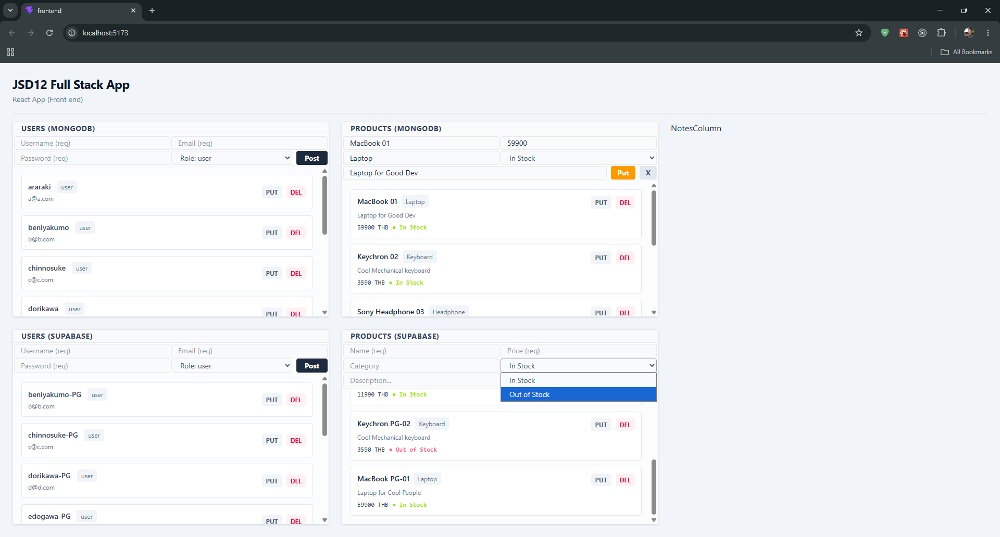

# JSD12 Week12 | Full Stack App (Frontend)

# API Testing Playground

## Overview

- A single-screen dashboard built with **React**, **Vite**, and **Tailwind CSS v4** to test front-end integration with multiple databases.
- Connects to an Express API server running locally on port 3002.

- Implements dual-database architecture handling parallel data streams from both **MongoDB** and **Supabase (PostgreSQL)**.

## Current Status & Architecture

- **Completed Users CRUD:** Functional Create, Read, Update, and Delete operations for both database panels.

- **Strategic Refactoring (SoC):** Completely decoupled business logic from UI rendering:
- **Custom Hook (`useCrud`):** Manages all API operations, state updates, and form submissions.
- **Component Composition:** Implemented the `children` pattern via `<ColumnPanel />` to create a lightweight, reusable layout wrapper.

## Upcoming Roadmap

#### ~~- Integrate the **Products Column** (Dual-DB CRUD).~~ - Done

#### ~~- Integrate the **Notes Column** (Dual-DB CRUD).~~ - Done

### prepare for next step.. (Admin/users Dashboard, manage products with Task notes?)

## Why No Extra Packages? (Context API / React Router DOM)

- **State Isolation:** Data for users, products, and notes are independent. Local state keeping data flows close to their destination is cleaner than a global state store.
- **Single-Screen Architecture:** The entire app functions within a unified dashboard grid, eliminating the need for client-side URL routing.
- **YAGNI & Performance:** Avoids accidental complexity and over-engineering, keeping the application light, highly performant, and reliant on native React capabilities.
